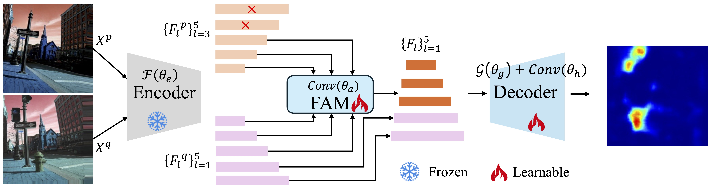
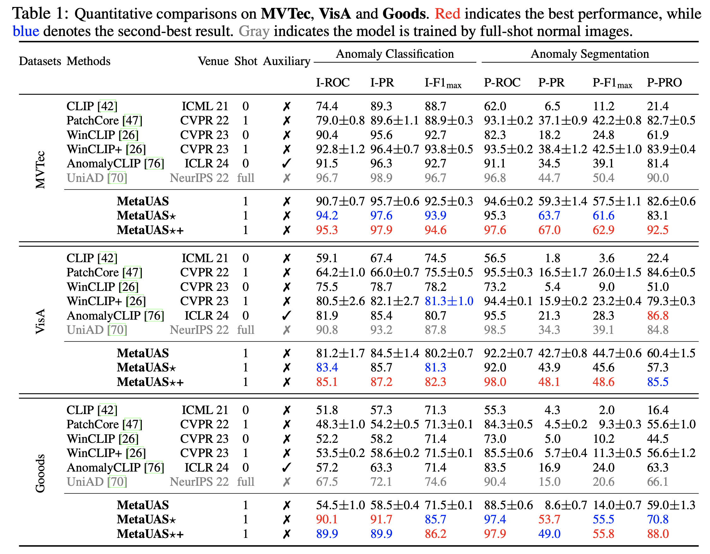
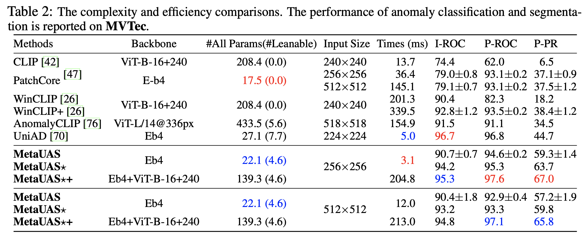

# [**NeurIPS 24**] MetaUAS

[](https://huggingface.co/spaces/csgaobb/MetaUAS)


> Official PyTorch Implementation of [MetaUAS: Universal Anomaly Segmentation with One-Prompt Meta-Learning](https://proceedings.neurips.cc/paper_files/paper/2024/file/463a91da3c832bd28912cd0d1b8d9974-Paper-Conference.pdf), NeurIPS 2024.

## Updates

- [2026-02-05]: Added 1-shot MetaUAS results on Real-IAD and Real-IAD-Variety datasets.

| Datasets | Methods | I-ROC | I-PR | I-F1 | P-ROC | P-PR | P-F1 | P-PRO |
| :--- | :--- | :---: | :---: | :---: | :---: | :---: | :---: | :---: |
| **Real-IAD** | MetaUAS (1-shot) | 80.0 ± 0.4 | 77.9 ± 0.4 | 72.4 ± 0.4 | 95.6 ± 0.2 | 36.6 ± 1.1 | 39.7 ± 1.0 | 83.5 ± 0.7 |
| **Real-IAD-Variety** | MetaUAS (1-shot) | 81.9 ± 0.1 | 96.3 ± 0.1 | 94.1 ± 0.0 | 92.0 ± 0.1 | 48.2 ± 0.4 | 48.3 ± 0.3 | 76.5 ± 0.1 |

## Introduction 
MetaUAS unifies anomaly segmentation into change segmentation and provides a pure visual foundation model, which requires only one normal image prompt and no additional training, and effectively and efficiently segments any visual anomalies.  MetaUAS significantly outperforms most zero-shot, few-shot, and even full-shot anomaly segmentation methods. 

## MetaUAS Framework



## Main Results






## Demo
You can use our [Online Demo](https://huggingface.co/spaces/csgaobb/MetaUAS) to test your custom data for a quick start. Note that the online demo is currently based on CPU.
You could also deploy the demo application to your local CPU/GPU server using the following command:
```
pip install -r requirements.txt
python app.py
```

## Evaluation on MVTec/VisA/GoodsAD
```
bash test.sh
```
## ToDo List
- [x] release pre-trained [MetaUAS models](https://huggingface.co/csgaobb/MetaUAS)
- [x] deploy [online MetaUAS Demo](https://huggingface.co/spaces/csgaobb/MetaUAS)
- [x] open testing code
- [ ] open training code


## Citing
If you find this code useful in your research, please consider citing us:

```
@inproceedings{gao2024metauas,
  title  = {MetaUAS: Universal Anomaly Segmentation with One-Prompt Meta-Learning},
  author = {Gao, Bin-Bin},
  booktitle = {Advances in Neural Information Processing Systems},
  pages = {39812--39836},
  year = {2024}
}
```


## Star History

[](https://www.star-history.com/#gaobb/MetaUAS&Timeline)
